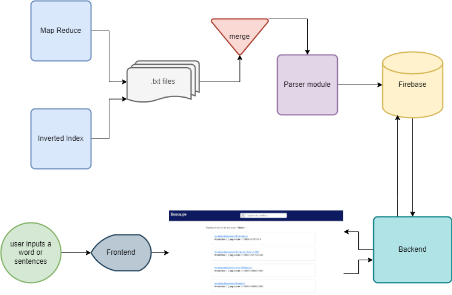

# busca.pe

**busca.pe** is your _one and only_ search engine. It is based on MapReduce algorithms such as Inverted Index and PageRank, which allows to process a huge amount of data in a parallel, reliable and efficient way. Start now your search experience by navigating on our delightful interface. :)

## Table of contents

- [busca.pe](#buscape)
  - [Table of contents](#table-of-contents)
  - [Architecture](#architecture)
  - [Requirements](#requirements)
    - [Data](#data)
    - [Inverted Index](#inverted-index)
    - [PageRank](#pagerank)
    - [Join part-r-\*](#join-part-r---)

## Architecture



## Requirements

### Data

- Use [crawl.sh](./crawl.sh) to get a list of websites, for example:

```
❯ ./crawl.sh https://en.wikipedia.org/wiki/Sorting_algorithm
```

- Synchronize to Google Cloud Storage: The following command synchronizes your local [data](./data) directory into Google Cloud Storage.

```
❯ gsutil -m rsync -r data "gs://{{BUCKET_NAME}}/data"
```

### Inverted Index

Clone branch [mr-search-engine](https://github.com/sharon1160/inverted-index/tree/mr-search-engine) from [inverted-index repository](https://github.com/sharon1160/inverted-index). Compile and create a JAR executable.

- Upload to Google Cloud Storage

```
❯ gsutil cp target/inverted-index-1.0-SNAPSHOT-jar-with-dependencies.jar "gs://{{BUCKET_NAME}}/invertedindex.jar"
```

- Create and submit job

Create a job following Google Dataproc schema, for example:

```
POST /v1/projects/{{PROJECT_ID}}/regions/{{REGION}}/jobs:submit/
{
  "projectId": "{{PROJECT_ID}}",
  "job": {
    "placement": {
      "clusterName": "{{DATAPROC_BUCKET_ID}}"
    },
    "statusHistory": [],
    "reference": {
      "jobId": "{{JOB_ID}}",
      "projectId": "{{PROJECT_ID}}"
    },
    "hadoopJob": {
      "properties": {},
      "jarFileUris": [
        "gs://{{STORAGE_BUCKET_ID}}/invertedindex.jar"
      ],
      "args": [
        "gs://{{STORAGE_BUCKET_ID}}/data",
        "gs://{{STORAGE_BUCKET_ID}}/invertedindex-output"
      ],
      "mainClass": "com.mycompany.app.InvertedIndex"
    }
  }
}
```

- Synchronize results: The following command synchronizes the results back to your local computer.

```
❯ gsutil -m rsync -r "gs://{{BUCKET_NAME}}/invertedindex-output" output/inverted-index
```

### PageRank

Clone branch [mr-search-engine](https://github.com/jersonzc/pagerank/tree/mr-search-engine) from [pagerank repository](https://github.com/jersonzc/pagerank). Compile and create a JAR executable.

- Upload to Google Cloud Storage

```
❯ gsutil cp target/pagerank-1.0-SNAPSHOT-jar-with-dependencies.jar  "gs://{{BUCKET_NAME}}/pagerank.jar"
```

- Create and submit job

Create a job following Google Dataproc schema, for example:

```
POST /v1/projects/{{PROJECT_ID}}/regions/{{REGION}}/jobs:submit/
{
  "projectId": "{{PROJECT_ID}}",
  "job": {
    "placement": {
      "clusterName": "{{DATAPROC_BUCKET_ID}}"
    },
    "statusHistory": [],
    "reference": {
      "jobId": "{{JOB_ID}}",
      "projectId": "{{PROJECT_ID}}"
    },
    "hadoopJob": {
      "properties": {},
      "jarFileUris": [
        "gs://{{STORAGE_BUCKET_ID}}/pagerank.jar"
      ],
      "args": [
        "gs://{{STORAGE_BUCKET_ID}}/data",
        "gs://{{STORAGE_BUCKET_ID}}/pagerank-temp",
        "gs://{{STORAGE_BUCKET_ID}}/pagerank-output",
        "5"
      ],
      "mainClass": "com.mycompany.app.PageRank"
    }
  }
}
```

- Synchronize to Google Cloud Storage: The following command synchronizes your local [data](./data) directory.

```
❯ gsutil -m rsync -r "gs://{{BUCKET_NAME}}/pagerank-output" output/pagerank
```

### Join part-r-\*

Join results from Inverted Index and PageRank algorithms into one text file. Go to [output](output) directory and run [join.sh](output/join.sh).
